# ICP Machine Learning Classification Using Gene Expression

This repository demonstrates the classification of intracranial pressure (ICP) status using machine learning algorithms and qPCR-based gene expression data.  
The project utilizes open-access data from the **NASA GeneLab OSD-364** study:  
*Inflammatory gene expression signatures in idiopathic intracranial hypertension: possible implications in microgravity-induced ICP elevation – Plasma* ([DOI:10.1038/s41526-017-0036-6](https://www.nature.com/articles/s41526-017-0036-6)).

---

## Background

Increased intracranial pressure (ICP) is a critical health risk for astronauts during long-duration space missions. This project applies machine learning techniques to identify clinical and gene expression markers of ICP elevation, using real patient data from NASA's open-access OSD-364 study.

---

## Project Overview

- **Data Source**: NASA GeneLab (OSD-364), [Ames Research Center](https://lsda.jsc.nasa.gov/Experiment/exper/13553)
- **Objective**: Classify ICP status (high/normal) and identify potential biomarker genes for ICP elevation, with implications for both neuroscience and space medicine.
- **Methods**:
  - Data preprocessing and feature engineering (age, weight, height, BMI)
  - Supervised classification (Logistic Regression, Random Forest, KNN)
  - Model evaluation (accuracy, precision, recall, ROC-AUC)
  - Model explainability (SHAP analysis)
  - Differential gene expression analysis (Mann-Whitney U test)
  - Dimensionality reduction (PCA) and clustering (K-Means)

---

## Repository Structure

- `icp_ml_classification.py`: Complete pipeline for data loading, preprocessing, modeling, evaluation, and visualization.
- `data_description.txt`: Description of variables and the study in English.
- `references.md`: Detailed study metadata, citation, and protocol information (optional).
- `example_data/`: (Optional) Placeholder for simulated or anonymized data.

---

## Results & Visualizations

### Feature Importance (Random Forest)
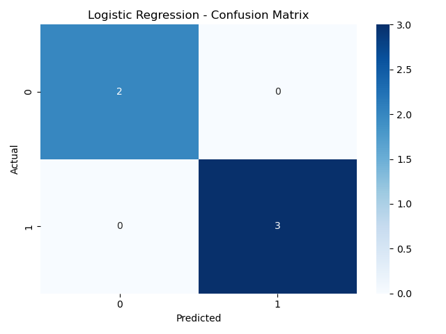

### Logistic Regression – Confusion Matrix
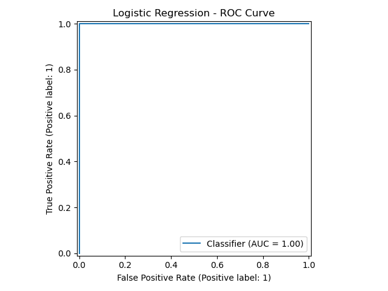

### Logistic Regression – ROC Curve
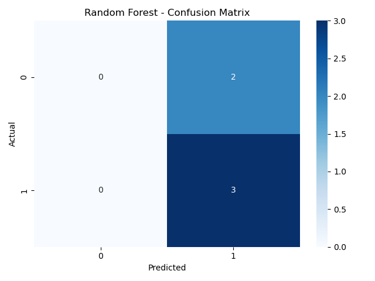

### Random Forest – Confusion Matrix
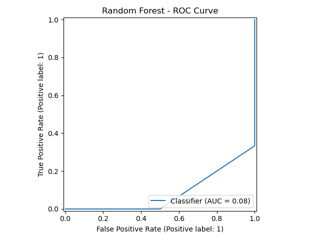

### Random Forest – ROC Curve
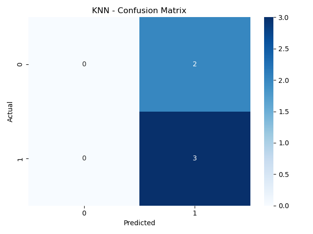

### KNN – Confusion Matrix
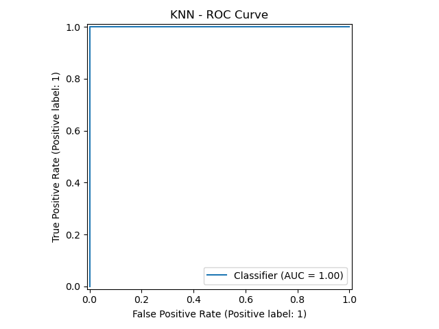

### KNN – ROC Curve
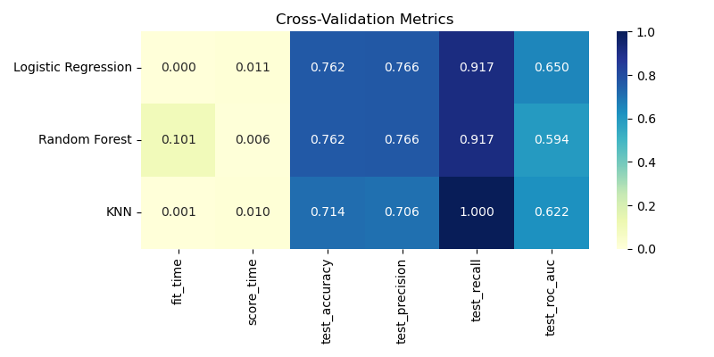

### Cross-Validation Metrics
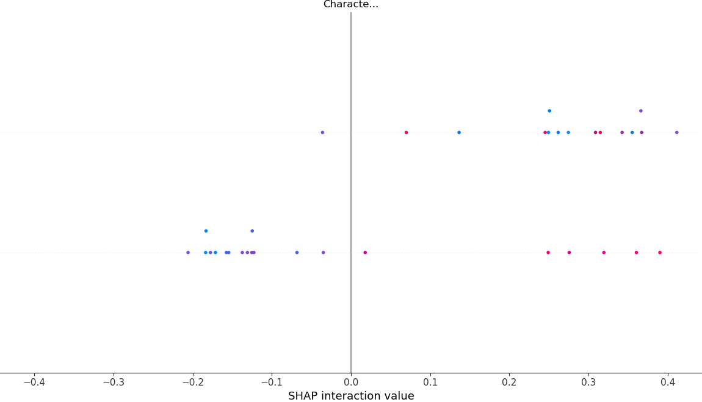

### SHAP Feature Interaction Plot
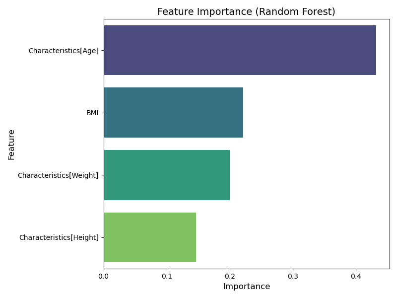

### PCA of Gene Expression by ICP Group
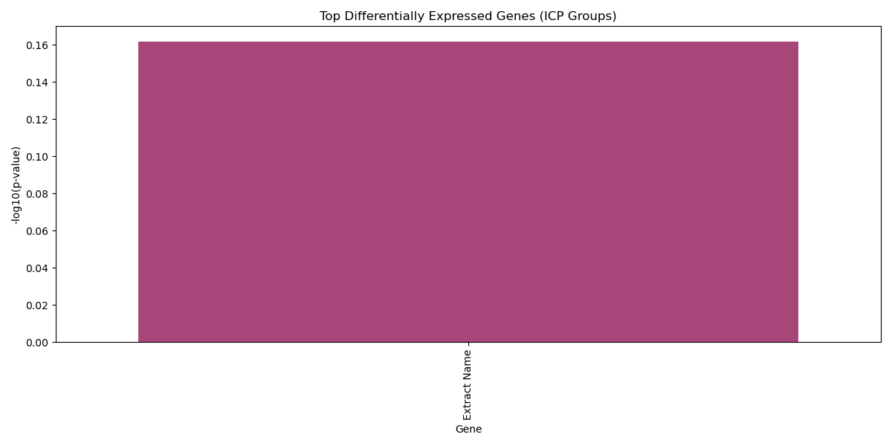

### KMeans Clustering on PCA-Reduced Gene Expression
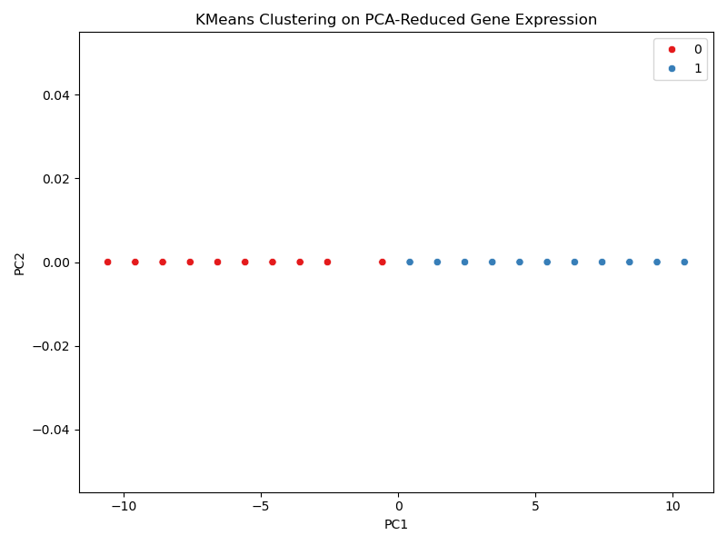

---

## Getting Started

1. Clone this repository.
2. Update data paths in `icp_ml_classification.py` as needed.
3. Install required packages:
    ```bash
    pip install pandas numpy seaborn matplotlib scikit-learn shap
    ```
4. Run:
    ```bash
    python icp_ml_classification.py
    ```

---

## Citation

If you use this code or approach, please cite the original dataset and publication:

> Zanello SB, Tadigotla V, Hurley J, Skog J, Stevens B, Calvillo E, Bershad E. (2018). Inflammatory gene expression signatures in idiopathic intracranial hypertension: possible implications in microgravity-induced ICP elevation. *npj Microgravity*, 4(1), 4. [https://doi.org/10.1038/s41526-017-0036-6](https://doi.org/10.1038/s41526-017-0036-6)

---

## Author

Halis Karaveli, 2025
